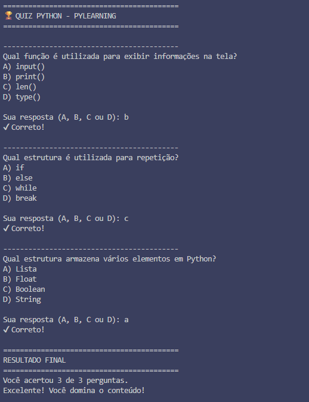
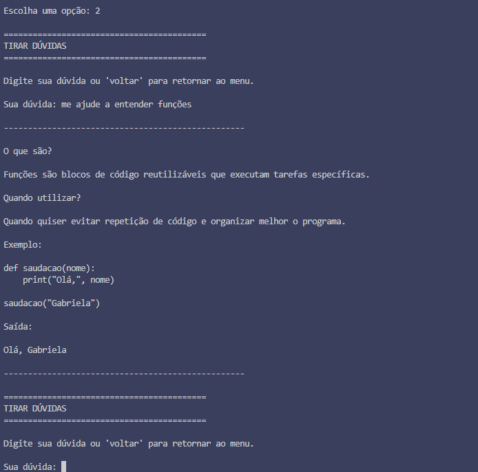
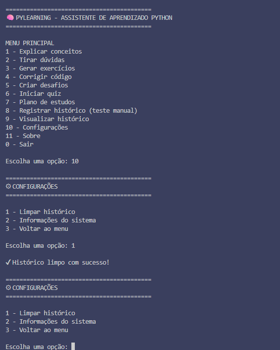
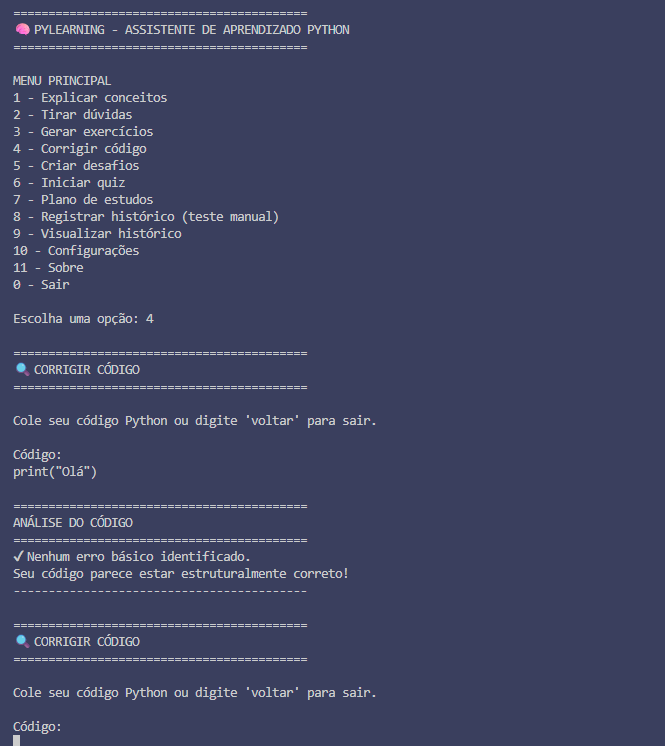
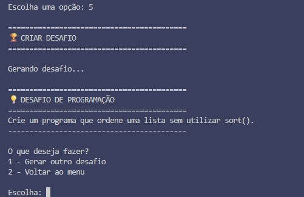
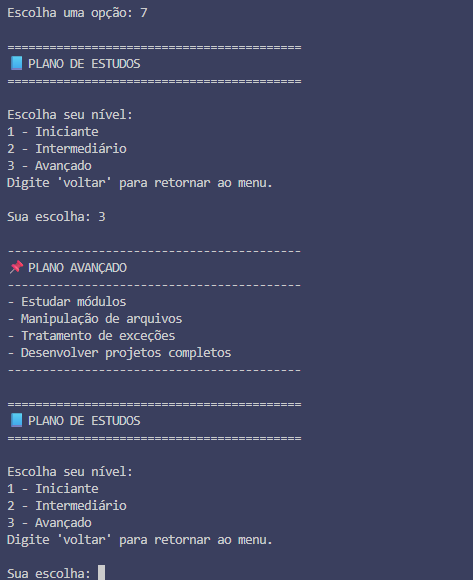
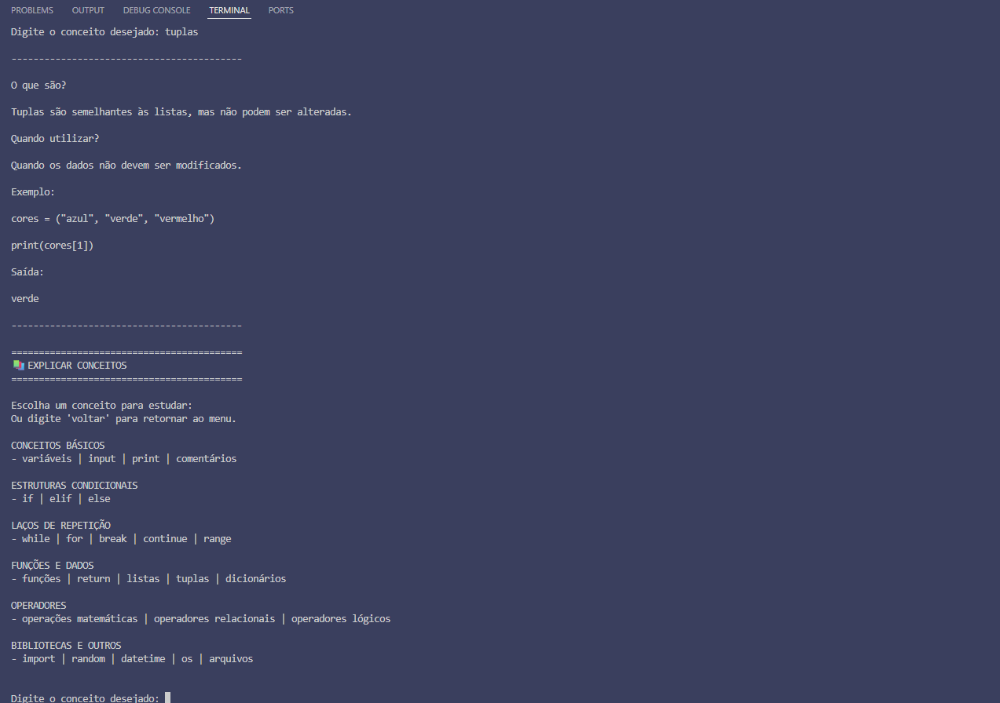
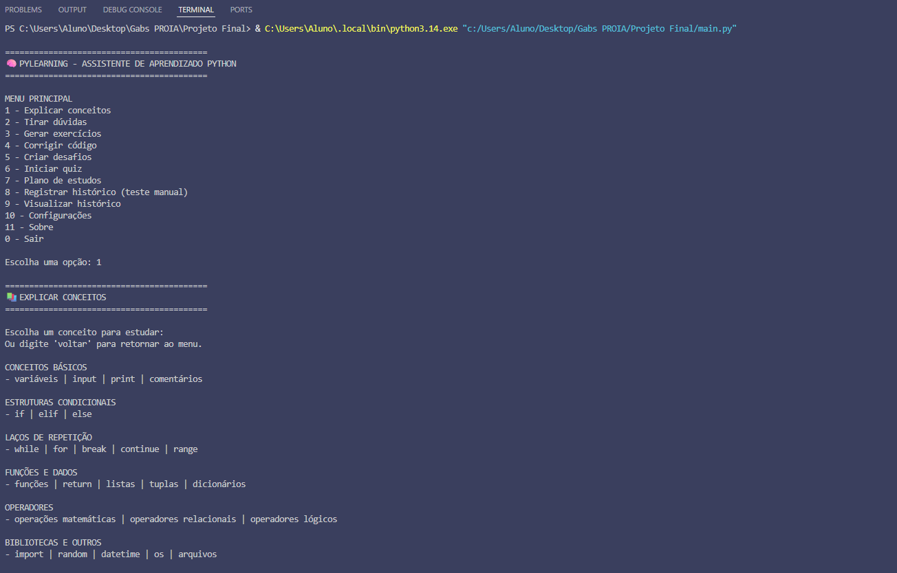

🧠 PyLearning

PyLearning é um assistente inteligente desenvolvido em Python com o objetivo de auxiliar estudantes no aprendizado da linguagem de programação Python. O projeto foi desenvolvido como trabalho final de um curso de Python com Inteligência Artificial, aplicando os principais conceitos estudados durante a formação.

🎯 Objetivo

O PyLearning busca oferecer um ambiente simples e intuitivo para apoiar o estudo da linguagem Python, reunindo em um único programa recursos para aprendizagem, prática e revisão de conteúdos.

✨ Funcionalidades

O sistema possui as seguintes funcionalidades:

📚 Explicar conceitos de Python
❓ Tirar dúvidas por meio de palavras-chave
📝 Gerar exercícios em diferentes níveis de dificuldade
🔍 Corrigir códigos com verificações básicas
💡 Criar desafios de programação
🎯 Iniciar um quiz sobre Python
📖 Exibir planos de estudo
🗂️ Registrar o histórico de utilização
📜 Visualizar o histórico de estudos
⚙️ Configurações do sistema
ℹ️ Informações sobre o projeto
🗂️ Estrutura do projeto

PyLearning/
│
├── main.py
├── funcoes.py
├── dados.py
├── historico.txt
└── README.md

Arquivos
main.py: responsável pela execução do programa e pelo menu principal.
funcoes.py: contém todas as funcionalidades do sistema.
dados.py: armazena listas, dicionários e demais informações utilizadas pelo programa.
historico.txt: registra automaticamente as ações realizadas pelo usuário.

🛠️ Tecnologias utilizadas

Python 3
Bibliotecas nativas:
random
datetime
os

💻 Como executar

Clone este repositório:
git clone <URL_DO_REPOSITORIO>
Acesse a pasta do projeto:
cd PyLearning
Execute o programa:
python main.py

📚 Conceitos aplicados

Durante o desenvolvimento foram utilizados diversos conceitos da linguagem Python, entre eles:

Funções
Listas
Dicionários
Estruturas condicionais
Laços de repetição
Manipulação de arquivos
Tratamento de exceções
Organização modular do código

🤖 Uso de Inteligência Artificial

A Inteligência Artificial foi utilizada como ferramenta de apoio durante o planejamento, organização, revisão e correção do projeto. Todo o código foi analisado e compreendido antes de sua implementação, sendo utilizado como recurso de aprendizagem e apoio ao desenvolvimento.

🚀 Melhorias futuras

Algumas funcionalidades planejadas para versões futuras incluem:

Sistema de login de usuários
Interface gráfica
Integração com APIs de Inteligência Artificial
Sistema de conquistas e pontuação
Correção de código mais avançada
Estatísticas de desempenho
Geração dinâmica de exercícios
Recomendações personalizadas de estudo

👩‍💻 Autora

Gabriela de Oliveira Silva

Projeto desenvolvido como trabalho final do curso Programação em Inteligência Artificial Generativa do SENAI "Oscar Rodrigues Alves".

Exemplos no VS Code:

